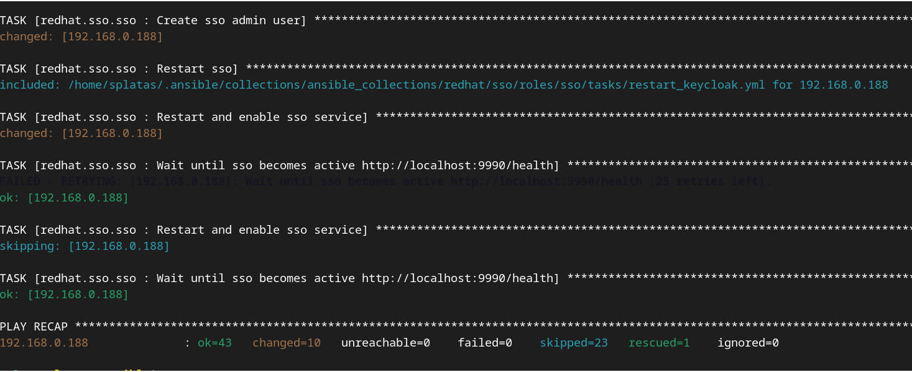
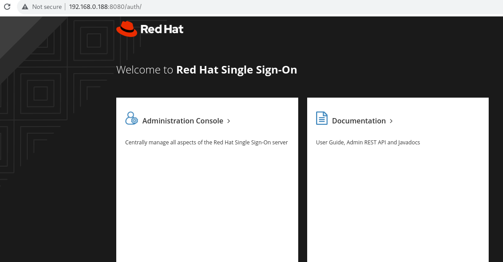
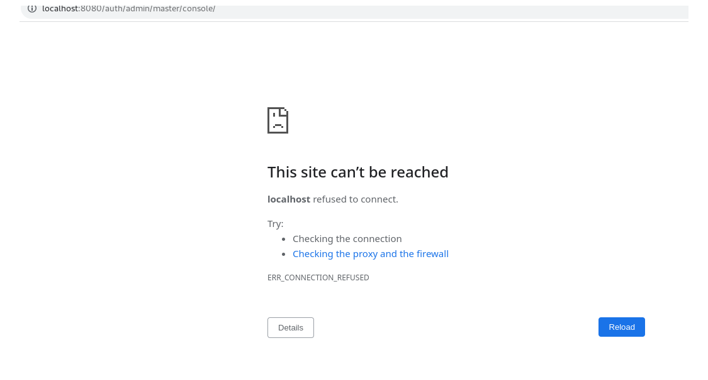

# RH-SSO Installation using Ansible playbook.
This installation process is based on the deployment of RH-SSO on an local or external machine.
At this moment it is needed to download the RH-SSO installation zip file manually. 
Deployment on Openshift is not included.

## Configuration
1. Playbook: **./install_rhsso.yml**
2. Inventory: **./inventory**
3. Configuration: **./ansible.cfg**

## Prerequiites
1. Download **Red Hat Single Sign-On 7.6.0 Server** installation file from this link: [https://access.redhat.com/jbossnetwork/restricted/softwareDownload.html?softwareId=104539] and 2. Move the downloaded file to [./files] folder in this project.
For example: files/rh-sso-7.6.0-server-dist.zip

2. Check (and update if needed) the defined IPs on 'inventory'. I.E: $ ping 192.168.0.188

## Instructions
1. Run this command:

$ ansible-playbook install_rhsso.yml --ask-become-pass

Where:
- --ask-become-pass: request password for host's root user

Expected result:

2. You should be able to access **http://IP_HOST:8080/auth**

   Use provided credentials: 
    
    - user: admin
    - pass: value defined on sso_admin_password variable.

Note: RH-SSO has a default setting to redirect all incoming request to 'localhost'. So, you are accesing to Admin Console from a remote host you will see a message similar to this:
'This site can’t be reached: localhost refused to connect.'

To solve this you need to apply this (NOT TESTED):
https://www.keycloak.org/server/hostname

