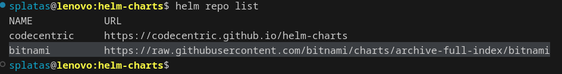
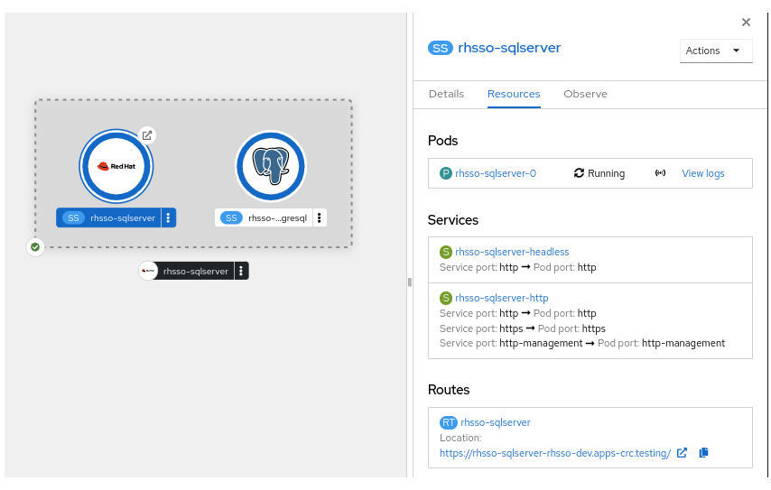

# Custom RH-SSO installation based on Helm 

## Prerequisites
1. To resolve dependencies (PostgreSQL DB) it is needed to run the following commands:

```console
helm repo add bitnami https://raw.githubusercontent.com/bitnami/charts/archive-full-index/bitnami
```

You should see:




2. Build dependencies: 

```console
helm dependency build ./charts/keycloak
```

## Installation

```console
export NAMESPACE=CHANGE_ME
```

To install RHSSO Helm Chart run the following command:
```console
helm install rhsso-sqlserver ./charts/keycloak -n ${NAMESPACE}
```





----

# codecentric Helm Charts

[](https://opensource.org/licenses/Apache-2.0)
[](https://circleci.com/gh/codecentric/helm-charts/tree/master)

This repo collects a set of [Helm](https://helm.sh) charts curated by [codecentric](https://www.codecentric.de).

## Usage

[Helm](https://helm.sh) must be installed and initialized to use the charts.
Please refer to Helm's [documentation](https://helm.sh/docs/) to get started.

Once Helm is set up properly, add the repo as follows:

```console
$ helm repo add codecentric https://codecentric.github.io/helm-charts
```

## Contributing

We welcome contributions.
Please refer to our [contribution guidelines](CONTRIBUTING.md) for details.
