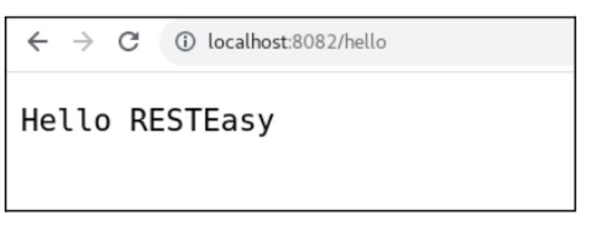
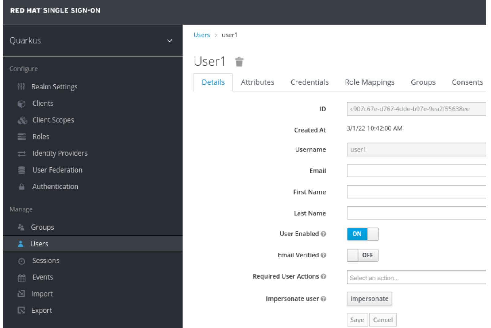
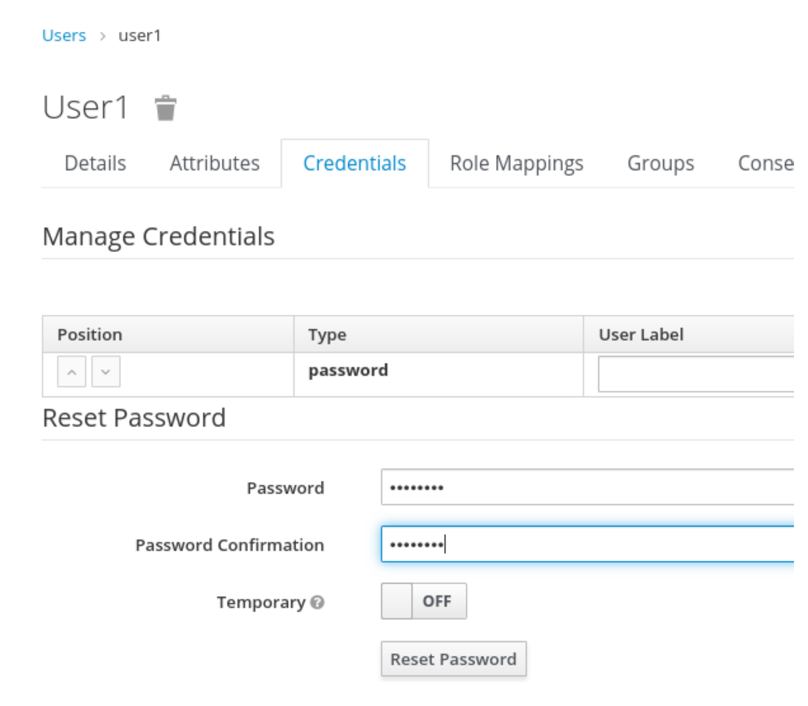
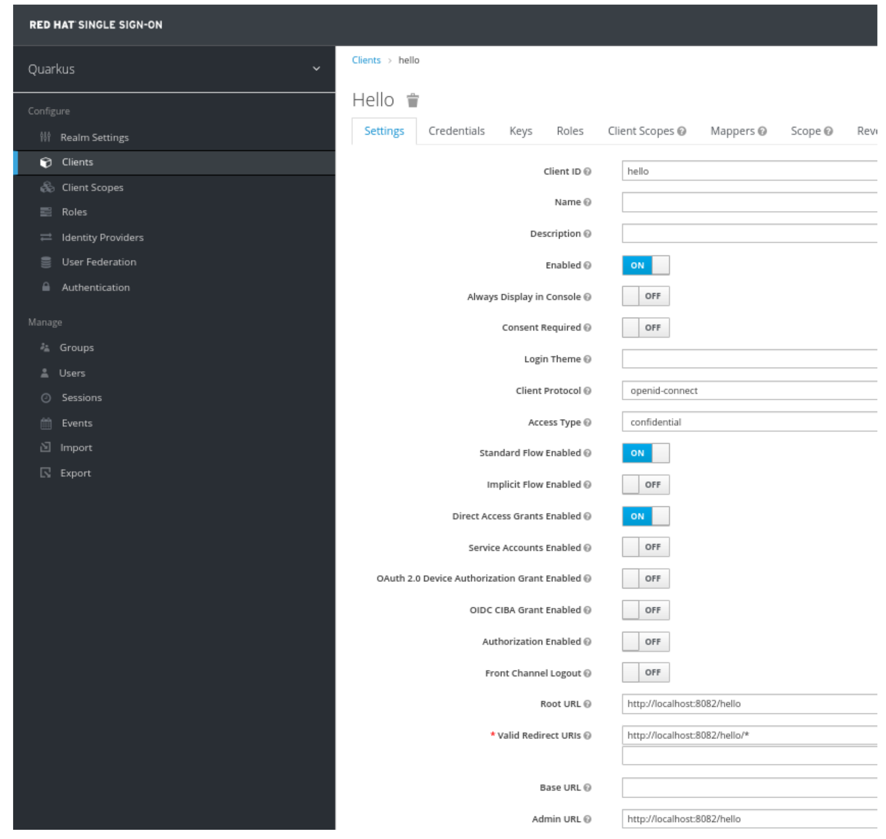
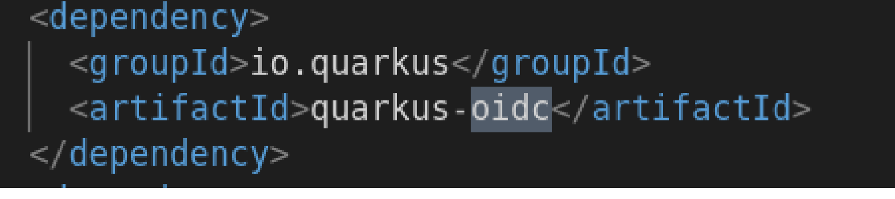
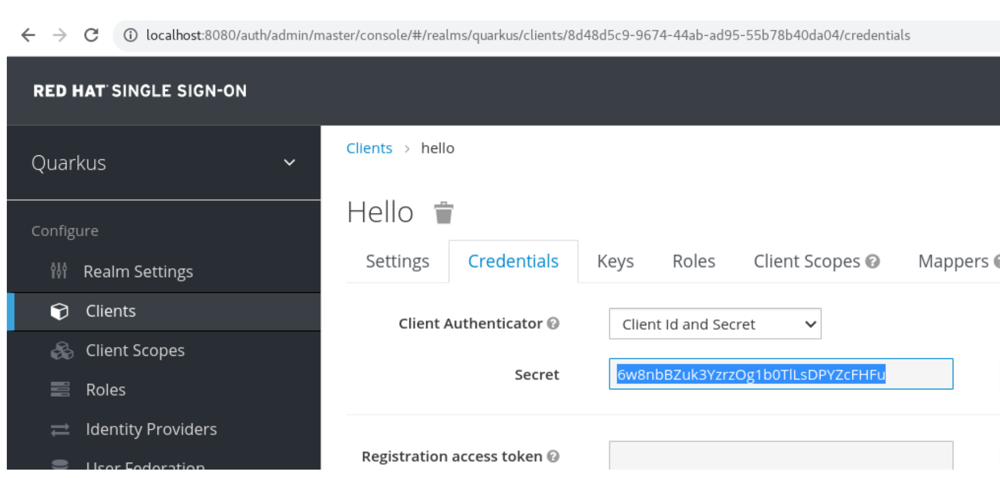
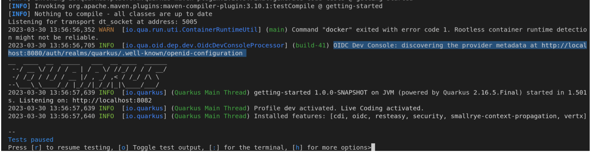
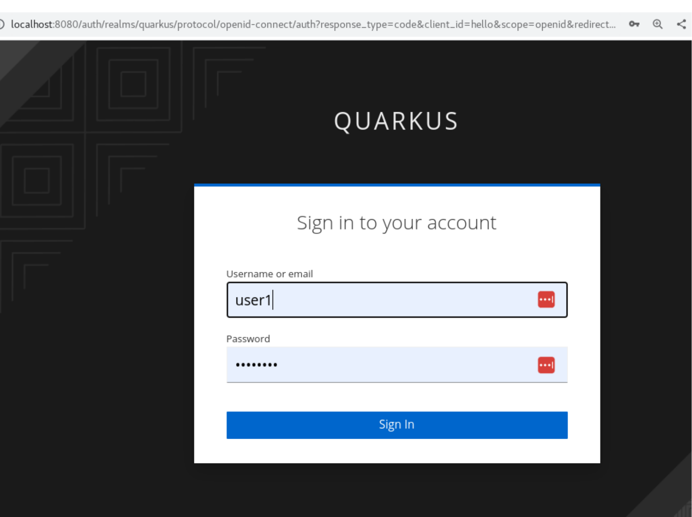

# Quarkus app secured with Red Hat's SSO

This project shows how to build and deploy a Quarkus application and secure it using RH-SSO.


> **_NOTE:_**  This project is based on following article: https://developers.redhat.com/articles/2022/04/21/add-security-quarkus-application-using-red-hats-sso


## Prerequisites
- A local instance of RH-SSO running
- Basic knowledge about RH-SSO administration
- Some knowledge about Java / Maven / Quarkus
- Maven client installed

---

## Create a Quarkus project
Create a base Quarkus app and then move to created folder:
```shell script
$ mvn io.quarkus.platform:quarkus-maven-plugin:2.7.1.Final:create \
    -DprojectGroupId=org.acme \
    -DprojectArtifactId=getting-started \
    -Dextensions="resteasy"
```
```shell script
$ cd getting-started
```

> **_NOTE:_**  By default a Quarkus app uses 8080 port. If you have an RH-SSO instances running locally, it could be a conflict due to RH-SSO uses 8080 port by default too. The recommendation here is to update 'application.properties' file (./src/main/resources/application.properties) adding:
```shell script
quarkus.http.port=8082
```

Start the app and test 'hello' endpoint with a 'curl' command:
```shell script
$ mvn quarkus:dev
```
```shell script
$ curl -w "\n" http://localhost:8082/hello
```
 <!--  -->


---

## Setting up RH-SSO
As we said previously we need an instance of RH-SSO running. For this example we have downloaded RH-SSO version 7.6 in a local folder.
Start the instance running the following command:

```shell
sh /opt/keycload/rh-sso/bin/standalone.sh
```

For details on how to do a local installation, please see: https://access.redhat.com/documentation/en-us/red_hat_single_sign-on/7.6/html-single/server_installation_and_configuration_guide/index#installing_the_software

Once running, go to the 'Admin Console' for RH-SSO at http://localhost:8080/auth/admin/. Create a realm called 'quarkus' and add a user named 'user1' to this realm.



It is necesary to set the password for this user:



Remember to change:
-Temporary: **OFF**

After this it is necesary to create a Client that we'll use to consume our secured Quarkus app.
Within the 'quarkus' realm, create a client named 'hello'. This corresponds to the Quarkus example application you've installed. Configure the client with:  

Where: 
- Client protocol: **openid-connect**.
- Access Type: **confidential**.
- Standard Flow Enabled: **ON**
- Direct Access Grants Enabled: **ON**
- Root URL: Our app URL
- Valid Redirect URIs: Where to redirect after a successfull login/logout.
- Admin URL: same as 'Root URL'




---

## Update the Quarkus application and configuration
With the following command our Quarkus app will be able interact with RH-SSO using OIDC.

```shell script
$ ./mvnw quarkus:add-extension -Dextensions="oidc" 
```

 The 'pom.xml' file will be updated with this:



Then we need to update the 'application.properties' settings:

```shell script
quarkus.oidc.auth-server-url=http://localhost:8080/auth/realms/quarkus
quarkus.oidc.client-id=hello
quarkus.oidc.credentials.secret=6w8nbBZuk3YzrzOg1b0TlLsDPYZcFHFu
quarkus.oidc.application-type=web-app
quarkus.http.auth.permission.authenticated.paths=/*
quarkus.http.auth.permission.authenticated.policy=authenticated
```

Where: 
- quarkus.oidc.auth-server-url: Realm URL on our RH-SSO instance
- quarkus.oidc.client-id: Client id created on RH-SSO realm.
- quarkus.oidc.credentials.secret comes from:



Then redeploy the app running the following command:
```shell script
$ mvn quarkus:dev
```

We should see how our app trigger the discovery process looking for the REALM we declared previously:



---
## Testing the secured application

### Using browser
Now if we try to access http://localhost:8082/hello, we'll be redirected to login page. We need to use the credentials defined for 'user1':



After sign in we'll be able to see the content:


### From command-line:
We can use **curl** command to test our app. If we try with the original command:
```shell script
$ curl -w "\n" http://localhost:8082/hello
```

... we now receive this response:
<mark>COMPLETAR</mark>


That is because our app just accept invocations with the properly credentials. So, now we need to send the following parameters:
- client_id:
- client_secret:
- username:
- password: 
- grant_type=password


```shell script
$ curl -d "client_id=hello" -d client_secret=ec7200d9-ccb3-4335-ac72-d2ccd2aab190 -d "username=user1" -d "password=password" -d "grant_type=password"  "http://localhost:8180/auth/realms/quarkus/protocol/openid-connect/token" | jq
```


<mark>COMPLETAR</mark>

---

# Java/Quarkus getting-started Project

This project uses Quarkus, the Supersonic Subatomic Java Framework.

If you want to learn more about Quarkus, please visit its website: https://quarkus.io/ .

## Running the application in dev mode

You can run your application in dev mode that enables live coding using:
```shell script
./mvnw compile quarkus:dev
```

> **_NOTE:_**  Quarkus now ships with a Dev UI, which is available in dev mode only at http://localhost:8080/q/dev/.

## Packaging and running the application

The application can be packaged using:
```shell script
./mvnw package
```
It produces the `quarkus-run.jar` file in the `target/quarkus-app/` directory.
Be aware that it’s not an _über-jar_ as the dependencies are copied into the `target/quarkus-app/lib/` directory.

The application is now runnable using `java -jar target/quarkus-app/quarkus-run.jar`.

If you want to build an _über-jar_, execute the following command:
```shell script
./mvnw package -Dquarkus.package.type=uber-jar
```

The application, packaged as an _über-jar_, is now runnable using `java -jar target/*-runner.jar`.

## Creating a native executable

You can create a native executable using: 
```shell script
./mvnw package -Pnative
```

Or, if you don't have GraalVM installed, you can run the native executable build in a container using: 
```shell script
./mvnw package -Pnative -Dquarkus.native.container-build=true
```

You can then execute your native executable with: `./target/getting-started-1.0.0-SNAPSHOT-runner`

If you want to learn more about building native executables, please consult https://quarkus.io/guides/maven-tooling.

## Related Guides

- RESTEasy Classic ([guide](https://quarkus.io/guides/resteasy)): REST endpoint framework implementing JAX-RS and more

## Provided Code

### RESTEasy JAX-RS

Easily start your RESTful Web Services

[Related guide section...](https://quarkus.io/guides/getting-started#the-jax-rs-resources)
