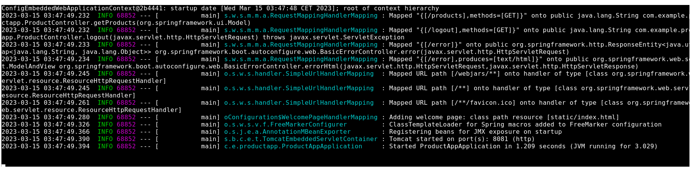

# Securing web application with Keycloack

This example is based on: https://developers.redhat.com/blog/2017/05/25/easily-secure-your-spring-boot-applications-with-keycloak#

## Spring Boot and Keycloak
Keycloak provides adapters for an application that needs to interact with a Keycloak instance. There are adapters for WildFly/EAP, NodeJS, Javascript and of course for Spring Boot.

## Setting up a Keycloak server
You have different options to set up a Keycloak server but the easiest one is probably to grab a standalone distribution, unzip it and voila! Open a terminal and go to your unzipped Keycloak server and from the bin directory simply run:

```
$ cd /opt/keycloak/rh-sso-7.6/bin
$ ./standalone.sh
```
Then open a browser and go to http://localhost:8080/auth.

Since it's the first time that the server runs you will have to create an admin user, so let's create an admin user with admin as username and admin for the password:


Now you can log in into your administration console and start configuring Keycloak.

## Creating a new Realm
Keycloak defines the concept of a realm in which you will define your clients, which in Keycloak terminology means an application that will be secured by Keycloak, it can be a Web App, a Java EE backend, a Spring Boot etc.

So let's create a new realm by simply clicking the "Add realm" button:


Let's call it "SpringBoot".

Creating the client, the role, and the user
Now we need to define a client, which will be our Spring Boot app. Go to the "Clients" section and click the "create" button. We will call our client "product-app":


We define the Access Type as **PUBLIC**: 


On the next screen, we can keep the defaults settings but just need to enter a valid redirect URL that Keycloak will use once the user is authenticated. Put as value: "http://localhost:8081/*" and save the changes.


Now, we will define a role that will be assigned to our users, let's create a simple role called "user":


And at last but not least let's create a user, only the username property is needed, let's call him "testuser":


And finally, we need to set his credentials, so go to the credentials tab of your user and choose a password, I will be using *"redhat01"* for the rest of this article, make sure to turn off the "Temporary" flag unless you want the user to have to change his password the first time he authenticates.

Now proceed to the "Role Mappings" tab and ***assign the role "user"***:


We are done for now with the Keycloak server configuration and we can start building our Spring Boot App!

## A simple app
In 'spring-boot-keycloak-tutorial' folder we have a full example of a Web App built with SpringBoot and integrated with Keycloak for security.
A simple **index.html** file is in "/src/main/resources/static":


Now we need a controller (spring-boot-keycloak-tutorial/src/main/java/com/example/productapp/ProductAppApplication.java):


As you can see, it's simple; we define a mapping for the product page and one for the logout action. You will also notice that we are calling a "getProducts" method that will return a list of strings that will put in our Spring MVC Model object.

### Defining Keycloak's configuration
Some properties are mandatory:


Where:
- server.port= **Port used by our SpringBoot app.** (8081)
- keycloak.auth-server-url= **Keycloak server 'URL+PORT/auth'**
- keycloak.realm= **Realm name**
- keycloak.resource= **Client name defined in the realm created**
- keycloak.public-client= **Public access defined for client** (true)
- keycloak.security-constraints[0].authRoles[0]= **Role needed to access the application**(user)
- keycloak.security-constraints[0].securityCollections[0].patterns[0]=**Secured URL pattern**(/products/*)


Now we can run our app:
```
$ cd ./spring-boot-keycloak-tutorial
$ mvn clean spring-boot:run
```



Now browse to "http://localhost:8081" and you should see the landing page, click the "My products" links and you will be redirected to the Keycloak login page:


Login with our user "testuser/redhat01" and should be redirected back to your product page:

